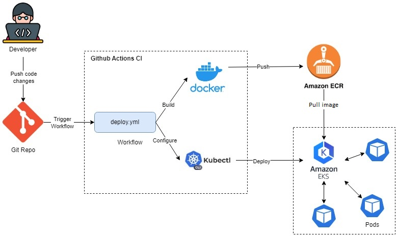

<h3> Continuous Deployment to Amazon EKS using GitHub Actions </h3>

</img>

<ol>
  <li>Developer commits the code.</li>
  <li>GitHub listens to push or pull requests.</li>
  <li>Triggers a workflow on those events</li>
  <li>Workflow includes dockerizing the application and pushing to Amazon ECR</li>
  <li>Later Configure AWS EKS cluster config by installing kubectl</li>
  <li>Deploy application to AWS EKS.</li>
  <li>Access the application by the endpoint given by EKS cluster</li>
</ol>
